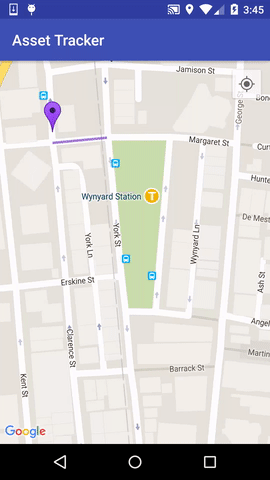

### Android Realtime Location Tracking with GCM sample

Use the client module(client app) to send the location data.

Use the server module(server app) to receive the location data from your assets(client apps).

*Add your API key and project number to `keys.xml`*

Current version of play services is `9.0.2`

*:)*